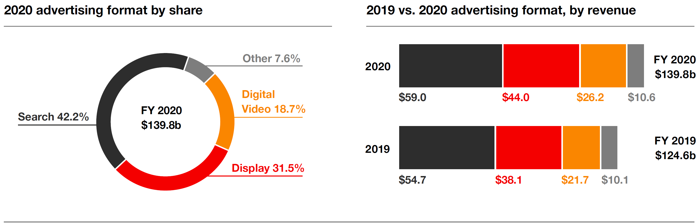
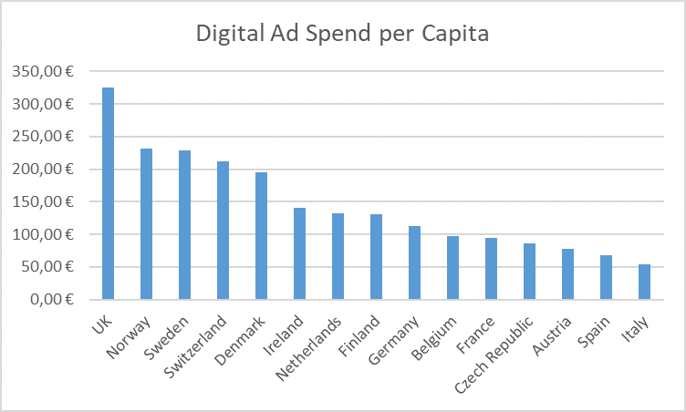

# Overview of the Online Advertising Industry

## Essential Actors: Advertisers, Publishers and Users

Online advertising is, in basic terms, a process in which an advertiser pays a publisher to present an ad to a user on the publisher's property (usually a website or an app).
Thus, there are three essential actors in online advertising (in alphabetical order):

-   the *advertiser*, who wishes to draw the user's interest to the advertiser's offerings;

-   the *publisher*, who has some space to show ads and would like to "monetize the user" by selling those ad spaces to the advertiser;

-    the *user*, who is primarily interested in the publisher's offering (e.g., the content of a news website) and is sometimes also interested in the ads displayed on the site.

Figure 1 outlines the business models of advertisers and publishers; the exchanges that occur among advertisers, publishers and users; and the (often implicit) agreements among them.

Many publishers offer users "free" access to their content---e.g., news---in exchange for the ability to collect data from these users, as well as to provide other actors, such as advertisers, with opportunities to contact the users.
Thus, even when users ostensibly receive content without paying for it, they are still paying---not with money but with their data and willingness to view ads.
Advertisers pay publishers for the opportunity to contact users and, to a lesser extent, pay for data about those users.
Advertisers then proceed to display ads to users and, in cases in which relevant data are available, they may target certain users and even personalize ads to their preferences.
Users, in turn, are expected to see those ads and, at least in some cases, to "purchase" the advertiser's offerings---where a purchase is broadly defined as a desired action that benefits the advertiser (including, for example, buying products, subscribing to an online newsletter, signing up for a test drive of a car, downloading a document, or donating).
At the heart of this interplay between the various actors is the tracking of users, which provides advertisers with two key capabilities.
The first is the capacity to process data about users for profiling, which enables advertisers to better target ads to appropriate users, and thus to avoid wastage of ads.
For example, an advertiser likely prefers to avoid sending a male user an ad for female hygiene products (and the other way around).
The second is the capacity to recognize, at least to some extent, whether the ads are successful---which, in turn, enables the advertiser to determine whether it is worthwhile to continue spending money on a given publisher (and, ultimately, on the publisher's users).
For example, if an ad served on a particular publisher does not receive any user reaction (as measured, e.g., by clicks on the ad), the advertiser might then conclude that, for the specific advertisement, the publisher does not attract the right audience, i.e., the right type of user.
Alongside these benefits, however, user tracking raises privacy concerns, as elaborated in subsequent sections.

## Scope and Types of Online Advertising 

The online advertising industry is large and represents an essential part of the economy.
Internet advertising revenues have grown consistently over recent years; in 2020, for example, the growth rate in the US was an impressive 12.2%, with revenues reaching \$139.8b (IAB 2021).
Advertisers spent 70% of all online advertising funds on advertising on mobile devices (including smartphones and tablets) and 30% on desktop platforms.
Regarding ad format, the largest share of funds (42.2%, see Figure 2) is spent on search engine ads, i.e., ads delivered via search engines, notably Google.
Display advertising (i.e., banner advertising) represents the second-largest share (31.5%), and video advertising, e.g., on YouTube, the third-largest share (18.7%).
Other forms of online advertising (e.g., classified advertising, audio formats, lead generation ads) play a minor role.
The ad-selling market is highly concentrated; indeed, in 2020, the top 10 publishers realized 78.1% of all advertising revenues (IAB 2021).
Google and Facebook are by far the two largest publishers in the Western world.
The ad-buying marketing is far less concentrated, i.e., there are no advertisers that dominate the demand side in a manner comparable to Google and Facebook on the supply side.

Figure 3 outlines the digital advertising spend per capita for selected European countries (IAB 2020).
Advertising expenditures per internet user are, by far, highest in the UK (324.70€), followed by Norway (231.30€), Sweden (229.40€), Switzerland (212.40€) and Denmark (194.80€).
In Germany, the average amount spent per Internet user is 113.40€.
Figure 3: Digital Advertising Spend per Capita in 15 countries (IAB 2020)

## Real-Time Bidding as a Process of Selling Online Advertising

In this subsection, we describe a prominent process of selling online advertising, which we refer to as "real-time bidding" (RTB), and which is also referred to in the industry as "programmatic advertising", because advertisers and publishers use algorithms to buy and sell advertising (Kosorin 2016).
The 2021 IAB report (IAB 2021) outlines that 88% of ads (excluding search) sell as programmatic advertising.
This process constitutes a key source of concern for regulators and privacy advocates.
For clarity of presentation, in what follows, our discussion focuses primarily on online display advertising (also referred to as banner advertising) but selling digital video ads shares many characteristics.
Online display advertising is well known to most users and raises many privacy concerns because it often involves exchanging data between firms.
It uses an auction-based system to sell ads, as search ads also do.
Other forms of advertising, including traditional offline advertising such as TV and outdoor, gradually implement comparable systems.
Real-time bidding is a collective term for the technological infrastructure used to sell opportunities to display an ad in real-time and in a fully automated manner (Yuan, Wang, and Zhao 2013, Wang, Zhang, and Yuan 2017).
In many cases, selling occurs via real-time auctions that run for less than 100 milliseconds (for reference, a blink of an eye takes 200-400 milliseconds).
Ad exchanges (e.g., Xandr), marketplaces that connect advertisers and publishers, frequently serve as platforms for such real-time auctions (Cristal 2014, Kosorin 2016, Lee, Jalali, and Dasdan 2013, Information Commissioner's Office 2019; Ada, Abou Nabout, and McDonnell Feit 2022).
Figure 4 illustrates the automated auction process under real-time bidding.
For convenience, we refer to a scenario in which an ad slot is being sold on a website, but the general process we describe is applicable to other online media that belong to a publisher and contain ad slots, such as apps.
As shown in the figure, whenever a user visits a publisher's website with ad slots (1), the publisher sends an ad call to an ad exchange (2).
This ad call is a request to run a real-time auction on the ad exchange and contains information about, for example, the properties of the ad slot (e.g., ad size) and a user ID, which we explain in more detail in Section 3.1.
The ad exchange then sends a bid request to all advertisers on the ad exchange (3).
Each interested advertiser submits a bid for displaying its ad to the user; the bid also includes the ad server's address with the ad (4).
The ad exchange determines the price and the winner of the auction and forwards this information to the publisher (5).
The publisher then asks the user's browser to load the ad from the ad server (6), and the ad is subsequently displayed to the user on the publisher's website (7).

This description of the real-time auction process is a simplification, because it only captures essential steps (for more details, see Cristal 2014, Kosorin 2016, Trusov, Ma, and Jamal 2016 or Wang, Zhang, and Yuan 2017).
It does not consider, for example, the specific requirements imposed by privacy laws such as the GDPR (which we will outline later in Section 6 when discussing the Transparency and Consent Framework (TCF)).
In addition, it is important to acknowledge that there are many other actors that support the activities of advertisers and publishers (Luma Partners 2021).
We describe these other actors in the following subsection.

## Description of Other Actors

Figure 5 classifies the numerous actors in the online advertising industry into several main groups that we will not all cover here.

")

Note that Luma Partners (2021) refer in this figure to an advertiser as a "marketer" and to users as "people".

An ad exchange, as noted above, is a marketplace where the demand side, i.e., advertisers, and the supply side, i.e., publishers, meet to fill ad slots (offered by publishers) with ads (provided by advertisers).
A demand-side platform (DSP) is a technology provider that supports the advertiser buying ad slots.
A supply-side platform (SSP) provides technology to support the publisher selling its ad slots.
An advertising agency helps the advertiser with the creation of the ad.
An ad server is a web server (i.e., a computer) that stores advertising content (e.g., banner ads).
It delivers that content to the publisher's ad slot and, thus, the user (in our setting, the user's browser).
Many additional actors exist that support the process of selling ad slots and delivering ads to those ad slots.
Among them are data management platforms (DMPs), which provide data about the user (e.g., demographics or user interests), or verification providers that verify that an ad appears on the correct publisher.
The advertiser and the publisher have to finance all actors.
As a result, the price that the advertiser pays for an ad is often much higher than the amount that the publisher receives.
Google, for example, outlines that its publishers received over 69% of the money that the advertiser paid (Hsiao 2020).
The share of the money that the publisher receives goes further down if the seller and buying of ads involve more actors.
For example, the Guardian reports that this share can drop to 30% (Pidgeon 2016).

Figure 6 provides a schematic illustration of how the various actors operate together to produce what the user ultimately views (in terms of both content and ads).
In effect, when the user visits a publisher's website (e.g., a news website), two processes are initiated.
The first process (marked in orange) delivers the website's primary content (in our example, news content).
This content is available on the publisher's content server.
The second process (marked in blue) is the process through which ads slots are sold and ads are delivered to the user.
Our discussion focuses on the latter process; accordingly, in Figure 6, the process marked in orange is simplified and does not include other actors that may be involved in content delivery, such as measurement and analytics providers that track, for example, how often a user saw certain content and that help the publisher optimize its content.

The process of selling ad slots and delivering ads involves the following steps.
The publisher's ad server recognizes an available ad slot (usually even multiple ad slots) that the publisher would like to fill with an ad.
The ad server approaches the supply-side platform (SSP) with a request to sell the ad slot on the ad exchange.
The SSP sets up the auction on the ad exchange, and the ad exchange approaches the advertisers, usually via several demand-side platforms (DSPs), with a request for a quote for the ad slot, i.e., offering the opportunity to buy the opportunity to display an ad to the specific user.
It is essential to understand that any data that the publisher reveals can spread to many other actors.
That is a concern that Ryan (2018) raises.
He outlines that it is technically feasible to share a wide range of information along the chain outlined in Figure 6.
Such sharing raises privacy concerns.
It is, however, less clear whether and how intensively sharing of personal data occurs.

## Main Takeaways 

The main takeaways from Section 2 are:

-    The three main actors in the online advertising industry are advertisers, publishers, and users.
    Between each pair of actors, a transaction takes place---whether implicitly or explicitly agreed upon.

-   70% of online advertising occurs on mobile devices (including smartphones and tablets).
    The main advertising formats are search engine advertising, online display advertising and video advertising.

-    Real-time bidding is the primary process through which the selling of display advertising occurs.
    Data sharing in real-time bidding is a source of privacy concerns.

-    Many publishers rely on advertising to finance their content.
    They often do not charge users, but users then pay by providing publishers and advertisers (often implicitly) with data, as well as willingness to view ads.

-   Selling and displaying online (display) advertising involves many different actors and requires sophisticated technologies.
    Indeed, the online advertising industry is effectively a high-tech industry.
