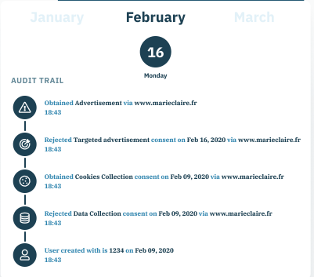

# Consent Management Tools

In the previous section, we discussed how the GDPR's requirement for a legal basis for data processing---which, for actors in the advertising industry, implies a need to get the user's explicit or implicit permission for data processing---entails costs to both publishers and users.
In what follows, we elaborate on tools that have been developed to mitigate these costs.
For the publishers, there are Consent Management Platforms (CMPs), which is software often combined with services, and for users there is software, often in the form of a browser extension.

## Consent Management Platforms (CMPs) for the Online Advertising Industry

A CMP is software that provides publishers with technical support in obtaining and managing users' permissions with regard to data processing.
It also centralizes information about users' permissions, such as when, where (on which website) and what permission occurred.
Table 7 illustrates the core functionalities of a CMP (Gradow and Greiner 2021).
Though some publishers implement and run their own CMPs in-house, others rely on external firms, called CMP-providers, that implement and run CMPs for them.

")

### Use of CMPs for Requesting User Permission for Data Processing

A CMP provides publishers with the technology to create and display a request for permission, in the form of a cookie banner that is displayed to the user.
Some CMP-providers offer various additional services for enhancing the request for consent.
First, some CMP-providers offer A/B testing to optimize the design of the cookie banner, so as to increase the likelihood of obtaining the user's consent.
Such optimization includes testing variations in design elements such as the position of the banner or the color scheme, as well as variations in the text used to lead the user towards accepting tracking.
On the basis of its experience with various publishers, the CMP-provider gains crucial knowledge about optimal cookie banner design---knowledge that enhances the value of its services and makes it an essential actor in the online advertising industry.

A second service that CMP-providers offer is the detection of hidden trackers.
Under the GDPR, the publisher must inform the user about, and obtain permission for, all tracking activities on its website.
Yet, the publisher might not be aware of all implemented trackers.
Specifically, some trackers, called "piggyback trackers", hide within other trackers.
For example, a third-party cookie on publisher A's website might have a connection to another third-party cookie that publisher A is unaware of.
If publisher A fails to get permission for the activities of this hidden tracker, it will be in violation of the GDPR and risk incurring high fines.
CMP-providers that detect hidden trackers enable publishers to avoid this risk.

Third, CMP-providers can integrate different legal frameworks into the CMP and thus enable the CMP to adjust the cookie banner to the user's location dynamically.
A CMP can, for example, use the location of a user to detect which privacy law applies---e.g., the GDPR or the CCPA---and can adjust the request for consent (i.e., the cookie banner) accordingly.
In doing so, the CMP can help the publisher to comply with privacy regulations worldwide.

### Use of Consent Management Platform (CMP) for Managing Permission

In addition to supporting publishers in requesting permission, the CMP provides the technology to store, in a structured manner, information about a user's decisions in response to permission requests, alongside information about the cookie banner variant to which the user was exposed.
This structured storage facilitates the process of managing the user's permissions in several ways.

First, it enables the publisher to easily exchange information about the user's permissions with other involved parties.
If, for example, publisher A uses the service of firm B for the analysis of individual click-through rates, then firm B acts as a data processor on behalf of publisher A.
Firm B is only allowed to analyze the data if the user explicitly consented to this activity.
Therefore, publisher A and firm B need to exchange information about the user's permissions regarding personal data processing.

Second, the structured storage inherent to the CMP provides a technological interface for the user to update or retract permission.
By law, the user has the right to retract permission for data processing at any point in time.
Therefore, many CMPs enable the publisher to embed a link on its website that opens the cookie banner again (in many cases, this link directs the user to the second layer of the cookie banner), or that activates a user interface that offers the possibility to alter permissions for data processing.
Figure 13, for example, outlines the implementation of such a link on the website of Bloomberg Europe.
The link opens the second layer of the cookie banner of the website directly.

A third means by which the CMP facilitates consent management is by creating a so-called "consent log" containing a history of all events related to the user's permission decisions---including the initial decision and subsequent changes.
Such a consent log is helpful in documenting and retracing the history of a user's decisions with regard to consent (Figure 14).

An entry to such a log file consists of at least three elements:

-   an identifier, such as an anonymized IP address,

-   a time-stamp, and

-   the activity that the user performed, such as selecting the "accept all" option on the cookie banner.

{width="402"}

This consent log offers several benefits.
First, it provides the publisher with proof of its legal basis for data processing---i.e., the user's consent---if needed, for example, for compliance audit purposes.
Second, it allows the publisher to analyze when a user gave or retracted permission for various data processing activities.
For example, a user might provide publisher A with consent for behavioral targeting for advertising and retract the consent for behavioral targeting at a later point in time.
Combining data from the consent log file with data about delivered ads could then help the publisher understand which advertising might have led to the retraction of consent.

## Software for the User

The user's challenge when browsing online is to decide on and respond to each website's initial request for permission, keep track of all decisions and update the decisions if desired.
Researchers from academia and industry started to develop, often in cooperation, so-called "Personal Information Management Services" (PIMS).
The underlying vision of most PIMS is the provision of a tool that centralizes all information regarding a user's data and enables the user to manage all in and outflow of the user's data in one place.
The scope of these PIMS is usually beyond mere consent decisions and often includes all sorts of data, including data from social media such as Instagram, LinkedIn or Twitter.

Many PIMS aim at automatically detecting and responding to data requests, such as consent requests.
In such a case, the user only needs to provide her privacy preferences once in the PIMS and update it if the privacy preferences of the user change.
Such an update then automatically notifies and updates all other actors that process the user's data.

Automating requires synchronization between the user's PIMS and data controllers and data processors from the industry.
This synchronization poses several challenges, such as establishing connections between all the involved actors and a common technical language.
At this point, many technical and legal challenges persist, such as whether the PIMS should save the user's data in the cloud, which facilitates synchronization among actors, or locally on the user's device, which usually offers higher data security.
Given the various challenges, most PIMS are still under development.

Currently, users mainly have access to a few tools providing a basic version of a PIMS and focusing on consent decisions.
These tools are browser extensions, available free of charge, primarily for Google Chrome and Mozilla Firefox.
Subsequently, we describe them in more detail.

### Use of Browser Extensions for Making Decisions on Permission

The few browser extensions that assist the user in deciding on permissions for data processing either block cookie banners or automatically respond to requests for permission for personal data processing.
Using a browser extension that blocks cookie banners means that the user does not grant permission for any data processing activities.
In other words, legally, the user is a "deny all" user.
On some websites, the user appears technically with an unanswered request for permission, which can interfere with website functionality.

Among browser extensions that respond automatically to cookie banners, some block all cookies, whereas others provide "minimal consent", i.e., they only allow first-party cookies that are required for the website to function (= "functional cookies").
A significant problem with these automatic responses is that specifications of consent differ widely across cookie banners.
Some rely on the function that cookies fulfill (e.g., functional cookies, analytics cookies, marketing cookies), some use the Transparency and Consent Framework (TCF)---a framework developed by IAB Europe for obtaining consent (described in detail in Section 7); and the rest use other specifications.
Thus, even if a browser extension is informed of the user's preferences, it might not be able to respond appropriately to all websites' specifications.

A notable example of a very promising browser extension is the "advanced data protection control" (ADPC) browser extension, which offers advantages for publishers and users.
ADPC is a joint project of the consumer protection agency NOYB (Section 9.4.1) and the Sustainable Computing Lab at the Vienna University of Economics and Business.
ADPC allows publishers to request permission either using the TCF or formulating specific permission requests, making ADPC interoperable with other systems.
It allows users to set general signals, e.g., "object to all", to set specific signals, e.g., consent to a specific request, or to combine general and specific signals, e.g., "reject all, but consent to requests 'A' and 'D'".
It allows users to either set global options that apply to all publishers or set publisher-specific preferences (www.dataprotectioncontrol.org).
ADPC is still under development, and a prototype is available in the browser's web store.
As of November 2021, ADPC has 145 Chrome users.

The most downloaded browser extension, "I don't care about cookies", sometimes accepts all and sometimes accepts only necessary cookies, depending on what is technologically easier to execute for the extension.
The popularity of this browser extension (more than 600,000 downloads for Chrome as of November 2021) might indicate that many users prefer not to receive a cookie banner when visiting a website, and are willing to forgo the opportunity to make a differentiated decision regarding their permission preferences.

The use of these tools entails certain disadvantages.
First, these tools begin to operate before a website loads, thereby increasing the site's loading time and, in some cases, even preventing loading altogether.
These effects likely worsen the user's online experience.

Another concern is that some users might lack the technological sophistication needed to seek out these tools and install them.
A lack of technological expertise among users could explain why the download numbers of the browser extensions are relatively low.
Indeed, as of November 2021, most consent management-related browser extensions for Chrome have fewer than 1,000 downloads each.
Only a few browser extensions---e.g., Consent-O-Matic or Consent Manager---have up to 10,000 downloads.
The only browser extension with a truly substantial number of downloads is "I don't care about cookies", mentioned above---yet the 600,000 users who downloaded this extension are still a relatively meager group, given that the EU has about 400 million Internet users, and Chrome has a market share in Europe of 60%.

### Use of Browser Extensions for Managing Permissions

For the user, managing permissions entails keeping track of each decision made to grant a website permission for data processing.
A basic tool for this purpose would list all permissions that the user provided.
However, to the best of our knowledge, no browser extension or other tool exists to provide this service.
Some browser extensions support the user in making initial permission decisions and document websites where the user blocked cookies or cookie banners.
Major web browsers keep a record of installed cookies that users can access, enabling users to delete all or certain cookies.

With the development of PIMS, we will likely see such tools in the future.
Sophisticated versions could also enable the user to request information about the data stored on a particular website (Section 4.3.1) and request the deletion of the data.

## Main Takeaways

The main takeaways from Section 6 are:

-   CMPs help actors in the online advertising industry obtain and manage user permissions, towards supplying a legal basis for personal data processing.

-   CMP-providers provide publishers with services, alongside several additional benefits (e.g., cookie banner optimization), and have thus emerged as a new and important actor in the online advertising industry.

-   Only a few tools are currently available that help users make and manage decisions on permissions.
    These tools have certain disadvantages, including increasing page loading time, and some even conflict with website functionality.
