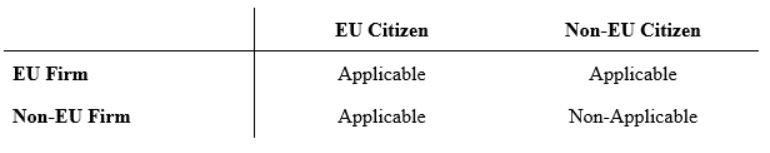
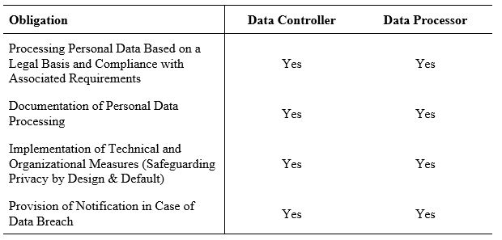
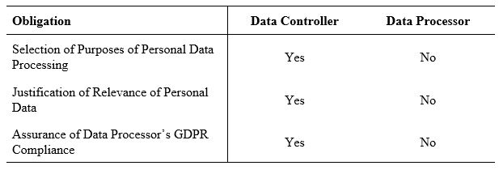
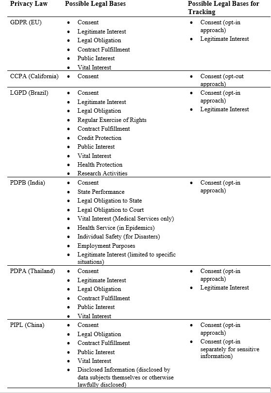

# Personal Data Processing under the GDPR

## Aim and Scope of the GDPR

The General Data Protection Regulation (GDPR) became effective in all member states of the European Union on May 25, 2018.
The regulation aims to increase consumer privacy by (i) strengthening consumers' control over their personal data (see Section 4.2 for the GDPR's precise definition of personal data); and (ii) harmonizing EU member states' existing national privacy laws via one regulation for all EU member states.
The GDPR achieves these aims both by defining users' rights with regard to their personal data (see Section 4.3) and by imposing obligations on firms that process such data (see Section 4.4).
As elaborated in what follows, the GDPR defines the concept of personal data processing rather broadly---encompassing the collection of personal data, as well as the use and ultimate deletion of such data.

Unlike previous EU privacy laws, which only affected European firms, the GDPR applies not only to EU firms but also to firms outside the EU that process EU citizens' personal data.
The only case in which the GDPR treats European firms and non-European firms differently is with regard to the processing of personal data of non-EU citizens; in these cases, the GDPR applies to European firms but not to non-European firms, as outlined in Table 2.

## Definition of Personal Data

The GDPR defines personal data as follows (Article 4):

*[...] any information relating to an identified or identifiable natural person ('data subject'); an identifiable natural person is one who can be identified, directly or indirectly, in particular by reference to an identifier such as a name, an identification number, location data, an online identifier or to one or more factors specific to the physical, physiological, genetic, mental, economic, cultural or social identity of that natural person.*

According to this definition, and in contrast to prior regulations, which only considered information that directly identifies a consumer (e.g., name, address, birth date, or social security number) as personal data, the GDPR considers personal data to include any information that directly or indirectly identifies a user (Bleier, Goldfarb, Tucker 2020).
Information that can indirectly identify a user includes online identifiers such as cookies and digital fingerprints.
Therefore, firms that adopt such tracking techniques have to comply with the GDPR.

The GDPR strictly differentiates between pseudonymous data, to which the GDPR applies, and anonymous data, to which the GDPR does not apply.
Personal data are considered pseudonymous if they do not directly identify a user but can be used to identify a user indirectly.
For example, a customer number (e.g., "123456789") does not, in itself, directly identify a user.
However, when combined with information relating the customer number to an individual user (e.g., "123456789" represents user "X"), the customer number is considered pseudonymous data.
Personal data are only considered anonymized if they do not identify a user at all (e.g., it is unknown which user the customer number "123456789" represents).
Thus, firms that collect data from consumers and seek to avoid the GDPR cannot suffice with pseudonymizing user information but rather must anonymize it, which may be impractical and costly.

## User Rights with Regard to Personal Data Processing

The GDPR provides users with eight rights related to the processing of their personal data.
In what follows, and as summarized in Table 3, we classify these rights into three categories: rights that enable users to understand the processing of their personal data (Section 4.3.1); to change the processing of their personal data processing (Section 4.3.2), and to restrict the processing of their personal data (Section 4.3.3).

### Rights Enabling Users to Understand the Processing of Their Personal Data

The "Right to Information" states that a user has a claim to information about any firm that processes the user's personal data and about the firm's personal data--processing activities.
Such information includes the contact details of the firm, which types of personal data the firm processes, and the rationale behind the processing.
For example, if a user shops on an online platform, and the platform processes data from the user, then the user has the right to obtain contact details of the online platform.
Moreover, the user has the right to know if the firm has collected data about the products the user viewed and is using this information to recommend other products to the user.
This information puts the user in the position to contact the firm and enables the user to evaluate whether she agrees to the personal data processing.

The "Right to Access" entitles users to obtain copies of their personal data and further information about the personal data processing.
In our example, the user who shops on the online platform can ask for a copy of the personal data that the online platform has stored about her, and for information about all personal data processing activities.
Notably, this right forces firms that process users' personal data to document all of their processing activities.
The Right to Access enables users to gain an in-depth understanding of which personal data the firm processes for what purpose, providing additional information that can assist them in evaluating whether to consent to having their personal data processed.

### Rights Enabling Users to Change the Processing of Their Personal Data

The "Right to Rectification" provides a user with the opportunity to modify and correct potentially false or outdated personal data, which may harm the user otherwise.
For example, in a situation in which a user's financial information was processed for the purpose of determining credit eligibility, it may be that the user was not solvent and, thus, not eligible for credit.
However, once the user becomes solvent, the user may rectify the personal data about the insolvency, potentially preventing the information from harming future credit applications.

The "Right to Erasure" enables the user to force the firm that has processed the user's personal data to delete data that are not relevant for the purpose of the personal data processing.
This right enables the user to negotiate with the firm about the relevance of personal data and puts the firm in the position to justify the personal data storage if the firm does not agree with the erasure.
In our example, the user who became solvent may ask the firm to delete the past information about the user's insolvency because this personal data may not be relevant to assess the user's current solvency.

The "Right to Data Portability" enables the user to ask the firm to provide all personal data of the user to another firm in an accessible and machine-readable format.
For example, a user may ask her current bank to transmit all her personal data to a new bank.
This right decreases lock-in effects caused by so-called switching costs.
Switching costs occur if the user faces costs caused by switching from one firm's service to another firm.

### Rights Enabling Users to Restrict the Processing of Their Personal Data

The "Right to Restriction of Processing" enables a user to stop the processing of her personal data (temporarily) if the user doubts (i) the necessity to use the personal data to fulfill the purpose of the processing, (ii) the accuracy of (some of) the personal data used to achieve the purpose of the processing, or (iii) the lawfulness of the processing.
Therefore, this right enables the user to take actual control of her own personal data and requires the firm to justify (i) the necessity, (ii) the accuracy and (iii) the lawfulness of the personal data processing.
For example, suppose a user applies for credit, and an algorithm decides, on the basis of the user's personal data, whether the user should receive the credit.
If the user determines that the personal data used to make this decision are unnecessary, incorrect, or illegally processed, then the user can demand that the website stops processing the personal data.

The "Right to Avoid Automated Decision-Making" ensures that the user has the right not to be subjected to a decision based solely upon automated processing, including profiling.
This right applies primarily to cases in which decisions significantly impact the user, such as the refusal of an online credit application.
More specifically, this right enables the user to demand that the data-processing firm assign humans to monitor decision-making processes that are otherwise carried out automatically, as humans may better detect mistakes in such processes.
For example, if a user's credit application is rejected on the basis of an automated decision, then the user can object to the automated decision-making process and request that the firm (partially) re-evaluate this decision via a human.

The "Right to Object" entitles the user to object to the processing of personal data for marketing purposes, including marketing-related profiling.
More specifically, this right enables users to ensure that they do not receive content or ads based on their past browsing behavior, demographics or interests.
Therefore, this right enforces the user's fundamental right of informational self-determination.
Returning to our example, suppose that the user who has applied for credit begins to receive advertisements based on the user's solvency rating.
In this case, the user can object to this targeting strategy and can demand to see untargeted ads, which do not relate to the user's solvency rating.
In order to override a user's objection to the processing of personal data, a firm must demonstrate compelling legitimate grounds for doing so.

## Obligations for Firms that Process Personal Data

### The Role of the Firm: Data Controller or Data Processor

According to the GDPR, a firm that handles a user's personal data is classified under one of two essential roles: "data controller" or "data processor".
Each role entails specific responsibilities and obligations with regard to the processing of personal data---where a data controller has more obligations than a data processor.
It is possible for a firm to be a data controller in some cases and a data processor in others, but never both simultaneously.

#### Definition of Data Controller

The GDPR defines in Article 4 point (7) that a firm is a data controller if the firm has the obligation of deciding why and how to process the personal data (the "purposes" and "means" of processing).
Under the GDPR, the data controller faces several obligations, which we discuss in Section 4.4.2 and Section 4.4.3.

#### Defintion of Data Processor

The GDPR outlines in Article 4 point (8) that a firm is a data processor if it processes personal data on behalf of a data controller.
Thus, the data processor cannot decide why and how to process the personal data (the "purposes" and "means" of processing).
We discuss the obligations of the data processor in Section 4.4.2.

#### Relationship Between Data Controller and Data Processor

By definition, a firm cannot be both a data controller and a data processor for the same personal data processing activity; it must be one or the other.
Yet, a firm might be involved in multiple personal data processing activities (potentially even involving similar data)---and serve as a data processor in some activities and as a data controller in others.

For example, suppose that a demand-side platform (DSP) D receives a bid request from an ad exchange to bid on behalf of an advertiser A1 for a particular ad slot.
That bid request comes with personal data such as the user ID (or cookie ID) for the user who will be exposed to the ad, the publisher P1 to which the ad slot belongs, and the information that the user is likely to be male.
Concerning this bidding process, DSP D is a data processor because it processes personal data on behalf of the data controller (i.e., publisher P1, which sells the ad slot).

Assume further that DSP D also bids on behalf of another advertiser, advertiser A2, for an ad slot offered by a different publisher, P2.
In this bidding process, advertiser A2 also receives personal data.
DSP D remains a data processor for this bidding process because it processes personal data only on behalf of the data controller (i.e., publisher P2, which sells this ad slot).

However, DSP D turns into a data controller if it combines the personal information received from publishers P1 and P2.
For example, DSP D could develop profiles about users that contain information that both publishers provided to sell these profiles to advertisers.
The profiles are now the firm's "own" data.
Therefore, the firm becomes a data controller.

### Shared Obligations for Both the Data Controller and Data Processor

The GDPR stipulates several obligations with which both types of actors---the data controller and the data processor---must comply in order to engage in a particular activity involving the processing of personal data.
Table 4 outlines the most important ones.

The first obligation---processing any personal data based on a legal basis---entails justifying the data processing activity by choosing an appropriate legal basis; the GDPR stipulates six arguments that constitute acceptable legal bases for personal data processing.
The choice of a particular legal basis may be associated with additional requirements.
Section 4.4.4 provides a detailed discussion of the various legal bases and the requirements associated with each one.
While the data controller and data processor both need a legal basis, the choice of the legal basis is solely down to the controller.
As such, the data processor relies on the legal basis chosen and established by the data controller.

The second obligation is for the actor to document all steps taken as part of the personal data processing activity, including the choice of a legal basis and the measures implemented to ensure compliance with all obligations.
Third, the actor needs to implement appropriate technical and organizational measures to safeguard privacy by default and design.
Finally, in the case of a data breach, the data controller is usually required to notify the personal data breach to the supervisory authority within 72 hours.
In contrast, the data processor is required to notify the personal data breach to the data controller immediately.

For example, suppose that a firm has a database of customer email addresses (i.e., personal data), and it wants to send a newsletter to its customers to inform them about a sales event.
To this end, the firm must "process" the email addresses, e.g., by gathering relevant email addresses from the database and sending the newsletter to these addresses.
According to Table 4, the firm first needs a legal basis for this activity.
Suppose that the firm chooses to rely on users' explicit consent as its legal basis (see Section 4.4.4.2.2 for a detailed discussion of explicit consent as a legal basis for data processing).
In that case, the firm has to collect users' explicit consent to have their email addresses used for receiving newsletters.
Moreover, once the firm has chosen explicit consent as its legal basis, it needs to fulfill all associated requirements stipulated in the GDPR---e.g., informing the user of the purpose of personal data processing prior to requesting consent.

Second, the firm needs to document all its activities with regard to the processing of users' email addresses.
Notably, in line with the user's "Right to Access" (Section 4.3.1), if the user requests this documentation, the firm must provide it.
Third, the firm must implement appropriate technical and organizational measures to safeguard personal data.
For example, the firm could encrypt the files in the database to protect the email addresses from being stolen, or store more sensitive personal data about the users in a different database with pseudonymized email addresses.
Fourth, the firm needs to inform the supervising authority in the case of a data breach.

If the firm hires a digital marketing agency to promote its sales event, then the marketing agency acts as a data processor.
As such, it relies on the legal basis, i.e., explicit consent, chosen and established by the firm.
However, similarly to the firm, the marketing agency needs to document all personal data processing activities, implement appropriate technical and organizational measures to safeguard personal data, and inform the data controller in case of a data breach.

### Obligations for Data Controller but not Data Processor

The GDPR stipulates several obligations that apply to the data controller but not to the data processor.
Table 5 outlines the most important ones.

These additional obligations include a requirement for the data controller to select the purposes of processing personal data before processing the personal data.
Continuing our previous example, for the firm processing consumers' email addresses, the purpose of data processing might be "informing customers about a sales event".
An additional obligation that the data controller must fulfill is to justify the relevance of all personal data that the data controller processes.
In our example, the firm needs to be able to justify the relevance of processing the email addresses and any other personal data involved in this processing activity, such as names.
If the firm is unable to justify the relevance, then the user might rely on the "Right to Erasure" to have the irrelevant personal data deleted.
Regarding the firm's purpose to inform customers about a sales event, the firm might justify the processing of email addresses by referring to the requirement that the firm needs the customers' email addresses to send them emails about the sales event.
A further obligation for the data controller is to ensure the compliance of the data processor with the GDPR.
So, if the firm relies on a marketing agency to inform its customers about the sales event, the data controller needs to make sure, that the data processor fulfills all obligations of the GDPR regarding the specific personal data processing activities.

### Obligations with Respect to Legal Bases

As noted in Section 4.4.2, both the data controller and data processor are required to base the processing of personal data on a legal basis.
Article 6 of the GDPR, "Lawfulness of processing", defines six possible legal bases for data processing, and a firm must be able to document the presence of one of these legal bases in order to be able to lawfully process personal data for a specific purpose.
The applicability of each legal basis varies across industries.
In what follows, we elaborate on each legal basis based on the legal definitions made within the GDPR, classifying them according to whether or not they are relevant for the advertising industry.

#### Legal Bases not Relevant for Advertising

##### Vital Interest

The legal basis of vital interest applies to processing activities that are necessary to "protect vital interests of the user or another natural person" (Art. 6 point (1d), GDPR).
A vital interest exists if personal data processing aids in protecting a person's life (Recital 46, GDPR).
In other words, this legal basis applies to processing activities necessary for matters of life and death, such as medical emergencies: If an individual has life-threatening injuries from an accident and medics admit her to a hospital, then the processing of the individual's personal data, e.g., to admit the patient to the hospital, is necessary to protect the individual's life.
Due to its nature, the legal basis of vital interest does not apply to firms within the online advertisement industry.
Indeed, online banner advertisements cannot convincingly be a matter of life and death.

##### Public Interest

Public interest serves as a legal basis for processing activities that are necessary to enable tasks that are of "public interest or in the exercise of official authority" (Art. 6 point (1e), GDPR).
For example, a public interest may exist if the firm is a public authority.
Another example might be the processing of personal data, e.g., the name and address of an individual, for national elections, as the processing serves the public.

Similarly to vital interest, public interest is unlikely to apply as an appropriate legal basis for firms within the online advertising industry.
Unless firms are official authorities, online banner advertisements are unlikely to serve a public interest.

##### Legal Obligation

The legal basis of legal obligation applies if personal data processing is "necessary for compliance with a legal obligation" that binds a data controller or processor (Art. 6 point (1c), GDPR).
An example of a processing activity based on a legal obligation is if a court processes personal data when inviting witnesses.

Due to its nature, the legal basis of legal obligation is unlikely to serve as the most appropriate legal basis for personal data processing within the online advertising industry.

##### Contract Fulfillment

The legal basis of contract fulfillment applies if a data controller or processor has to process personal data in order to enable a user to enter into or complete a contract (Art. 6 point (1b), GDPR).
Such a legal basis might be applicable, for example, to a retailer selling clothes online: To complete a transaction---i.e., enter into a contract with the retailer---the user needs to provide personal data such as a name, shipping address, and credit card information.
Without the processing of such information, the contract between the two parties (provision of clothing in exchange for payment) cannot be fulfilled.

Data controllers may claim the legal basis of contract fulfillment when setting so-called "strictly necessary" cookies on their websites.
Strictly necessary cookies, also called technically necessary cookies, are essential for a website to function and for the user to use the website's features.
Such cookies include, for example, those that enable websites to process payment information or to save items placed in a shopping cart.

Although contract fulfillment can be an applicable legal basis for using (strictly necessary) cookies, it currently does not serve as a legal basis for personal data processing for the purpose of online advertising.
More specifically, cookies used for online advertising cannot be categorized as strictly necessary.
Thus, contract fulfillment currently cannot serve as a legal basis for firms in the advertising industry.
With the rise of the PUR model (see Section 5.2.2.2), however, contract fulfillment might play a more important role.

#### Legal Bases Relevant for Advertising

##### Legitimate Interest

Firms can apply the legal basis of legitimate interest if the personal data processing is "necessary for the legitimate interest pursued by a data controller or a third party, except where such interests are overridden by the interests or fundamental rights and freedoms of the [user]" (Art. 6 point (1f), GDPR).
To be able to claim this legal basis, a data controller must provide documentation on a case-by-case basis showing that its own legitimate interests in processing a user's data outweigh the user's interests in not having the data processed.

If a firm uses the legitimate interest claim as a legal basis for carrying out personal data processing activities, the firm needs to be transparent about the personal data processing activities and further inform the user that and how they can object to these activities (Art. 21, GDPR).
Therefore, loosely speaking, legitimate interest represents the opt-out approach of personal data processing: If the user does not opt-out of personal data processing based on legitimate interest, data controllers can process personal data.

A firm may make the argument that data processing for marketing activities serves a legitimate interest.
For a publisher, for example, collecting and using personal data can enable behaviorally targeted ads to be served to users, thereby generating revenues for the publisher (which, in turn, may offer its content for free to users---suggesting that the user's interests are not harmed).
At the same time, if a user might not reasonably expect personal data processing, it is harder for a firm to argue that a legitimate interest to process the personal data exists.

Thus, legitimate interest may be a legal basis that firms can use to justify the processing of users' personal data.
However, the Data Protection Authority responsible for a firm has to decide upon its applicability on a case-by-case basis.
Yet, the applicability for the legal basis of legitimate interest for tracking activities will likely be limited in certain countries.
For example, Germany eliminated the possibility to use legitimate interest for online tracking technologies with the Telecommunications and Telemedia Data Protection Act (TTDSG) that entered into force in December 2021.

##### Consent

The GDPR regulates the legal basis of consent in Article 6 point (1a) and in Article 7.
A user may give consent for "one or more specific purposes" of personal data processing activities.
Valid consent under the GDPR stipulates a privacy-preserving default, the opt-in approach, that we call "explicit consent".
This opt-in approach stipulates that without action by the user, the user does not give consent.
Additionally, consent needs to be:

-   **Freely given:** The user should not be or feel persuaded to give her consent.
    The consent must be given voluntarily, i.e., offering a real choice to the user.
    Above all, access to content or a data controller's offering must not be conditional on consent.
    Yet, there have been some cases in which DPAs allow the access to content being conditional on consent.
    Such a case would be the presence of an equivalent paid alternative (as, e.g., the Austrian DPA ruled in 2019, Datenschutzbehörde 2019).

-   **Specific:** The user has to give consent for specific purposes and third parties.

-   **Informed:** Before giving consent, a user needs to have access to information about the personal data processing and to be able to understand what the user is consenting to.
    This information should include the nature of personal data processed, the purposes of the personal data processing, who will have access to the data, and how the data controller safeguards the data.

-   **Unambiguous:** There must be no doubt whether a user has consented and to what a user has consented.

-   **Made with a clear affirmative action:** The user has to actively and explicitly give her consent.
    Without action by a user, the data controller cannot obtain consent.

Furthermore, after a user has given consent for a specific personal data processing activity, the user has the right to revoke the consent.
It must be as easy for the user to revoke her consent as it is to provide consent.
The user must be able to withdraw previously given consent at any point in time.
If a firm fulfills all of these requirements, it has obtained the user's valid consent.

An example of valid consent under the GDPR would be this scenario: A data controller informs the user about the personal data processing, the purposes of that personal data processing, and the third parties that will have access to the data.
After viewing this explanation, the user can tick several un-ticked boxes for each purpose of the personal data processing separately.
The data controller informs the user that and how she can withdraw consent at any time.
A user can access the service even if she denies consent.

To summarize, consent is a legal basis that firms within the online advertising industry can use for personal data processing.
Under the GDPR, consent is contingent on an opt-in approach.
This approach likely makes personal data processing transparent to the user.

## Specific Conditions Regarding Legal Bases for User Tracking Technologies

As the GDPR affects all processing activities that enable individuals to be identified, the tracking technologies discussed in previous sections---including login data, digital fingerprinting, and cookies---are all within the scope of the GDPR.
As such, these technologies should presumably be subject to the conditions outlined above regarding the applicability of the various legal bases.
Yet, recent state court decisions have imposed additional restrictions with regard to the use of tracking technologies in the advertising industry specifically.
In particular, the applicability of legitimate interest as a legal basis---one of the two legal bases that are relevant for the advertising industry (the other is consent; see Section 4.4.4.2)---has been limited with regard to tracking technologies that serve advertising purposes.
For example, in May 2020, the German Federal Court of Justice reinforced the Planet49 ruling by the European Court of Justice of October 2019, which effectively limits the use of legitimate interest as a legal basis for tracking technologies, instead requiring that data controllers and processors obtain valid consent (Information Commissioner's Office 2019).

The EU tried to mitigate uncertainties about the applicability of legal bases and the practical implementation of the GDPR's requirements for the digital world by drafting another regulation, the ePrivacy Regulation, which we discuss in Section 9.3.3.
This regulation intends to extend but not replace the GDPR's requirements in online settings.
In particular, it should regulate questions and uncertainties regarding online marketing.
However, this regulation has no finalized draft as of June 2021.
Consequently, it is currently difficult to claim legitimate interest as a legal basis for user tracking in online advertising.
This situation might change once the ePrivacy Regulation is finalized---though this is not very likely.

## Legal Bases for Tracking under other Privacy Laws

Though this chapter focuses on the EU's GDPR, it is important to acknowledge the numerous other privacy laws worldwide that handle various aspects of privacy---in some cases, similarly to the GDPR, and in others, slightly differently.
In Table 6, we compare some of these laws---specifically, with regard to their handling of legal bases for the processing of personal data in general, and for the use of tracking technologies in the online advertising industry specifically.

Table 6 shows that most major privacy laws worldwide require the same legal bases for tracking that the GDPR requires.
Some privacy laws even allow for legal bases other than those allowed by the GDPR (Brazil's LGPD, India's PDPB, China's PIPL).
Moreover, most privacy laws (LGPD, PDPB, PIPL, and Thailand's PDPA, in addition to the GDPR) entail similar criteria for valid consent---namely, users must provide consent explicitly (an opt-in approach), in a free, specific, informed, and unambiguous manner (see Section 4.4.4.2.2).
Thus, any firm worldwide that caters to users based in the EU, Brazil, India, China, or Thailand must comply with these requirements for consent.
California's Consumer Privacy Act (CCPA) is the only major privacy law that stipulates an opt-out approach to consent, i.e., users' consent is assumed unless they actively object to personal data processing activities.

The various countries also differ in terms of the penalties they impose for infringement of privacy laws.
A firm that infringes on the GDPR can be required to pay a fine of up to 4% of its global annual turnover or €20 million, whichever amount is higher.
Under the LGPD, fines can reach up to 2% of a firm's global annual turnover.
The PDPA and CCPA, in turn, specify flat sums at which firms can be fined: up to 5 million Thai Baht (\$150,000) for the PDPA and up to \$7,500 for the CCPA.
For grave violation against the PIPL, a firm must pay a fine of up to 5% of its annual turnover or 50 million Yuan (around \$8 million).
Moreover, the directly responsible person in charge can be fined under PIPL between 10 thousand and 1 million Yuan (\$1,600 to \$160,000).
So, China's privacy law (PIPL) is roughly as strict as the GDPR in terms of fines, the legal bases and the requirement of consent from the user to use their personal data.

## Main Takeaways

The main takeaways from Section 4 are:

-   The GDPR is a privacy law of the European Union applicable to all European firms and all firms processing personal data of European citizens.

-   The GDPR aims to give users more control over their personal data by defining user rights to understand, change, and restrict the personal data processing.

-   The GDPR increases responsibilities for all actors who process personal data.
    For a given data-processing activity, the GDPR defines an actor as either a data processor or a data controller, where data controllers have more obligations than data processors do.
    Data controllers are also responsible for the legal compliance of the cooperating data processors.

-   The GDPR stipulates that in order to process personal data, a firm must specify a legal basis for personal data processing.
    For firms in the advertising industry, the two applicable legal bases are legitimate interest and consent.

-   Loosely speaking, legitimate interest represents the opt-out approach for getting permission for personal data processing, whereas consent represents an opt-in approach.

-   Even though the GDPR identifies both consent and legitimate interest as applicable legal bases for firms in the advertising industry, courts have reduced the applicability of legitimate interest, consequently favoring consent.
